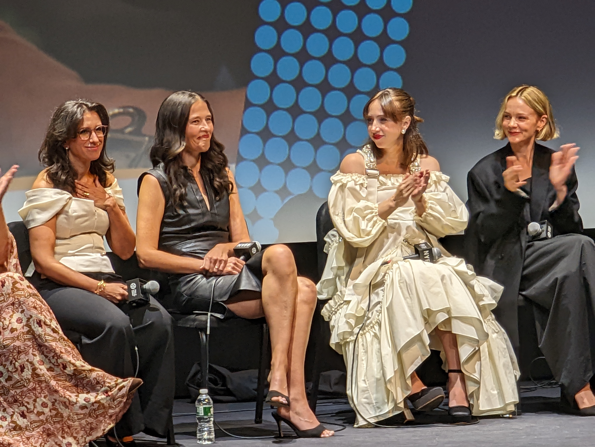

::: {.column-margin}

:::

## BLUF

Is "Reporting Procedural" a genre? **All The President's Men**,
**Spotlight**, **The Post**; **She Said** is cut from the same cloth; it
tells the story of Jodi Kantor and Megan Twohey's exposing of Harvey
Weinstein's many, many crimes against women and how they were covered up
by his enablers.

## Why should you see it?

It was gripping. Even knowing how things turned out, I couldn't help but
feel the suspense: would the reporters find someone willing to go on the
record? What would Weinstein and his people do to stop the story from
coming out? All over gain, I felt such rage at Weinstein and, even more,
at the legions of people who helped him. 82 women have gone on the
record as being victims of Weinstein. 

The cast is truly terrific. Carey Mulligan's portrayal of Megan Twohey
is almost an impression.

## Notes from the screening

All those helpers: lawyers, PR people, payers of hush money, they're
really accomplices.

The cast is terrific. It was a trip to see Megan Twohey on stage with
Carey Mulligan, and to experience how much Mulligan did to become
Twohey, to nail her voice and her physicality.

